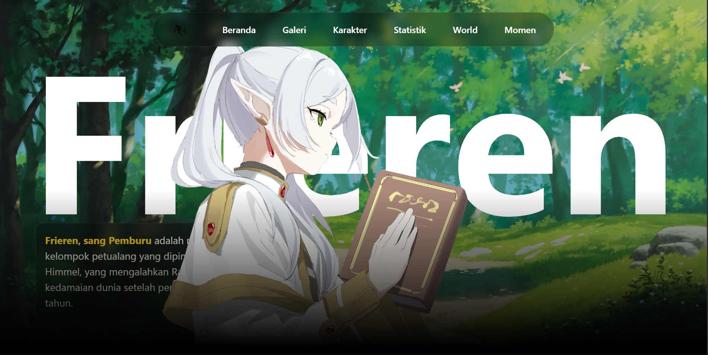
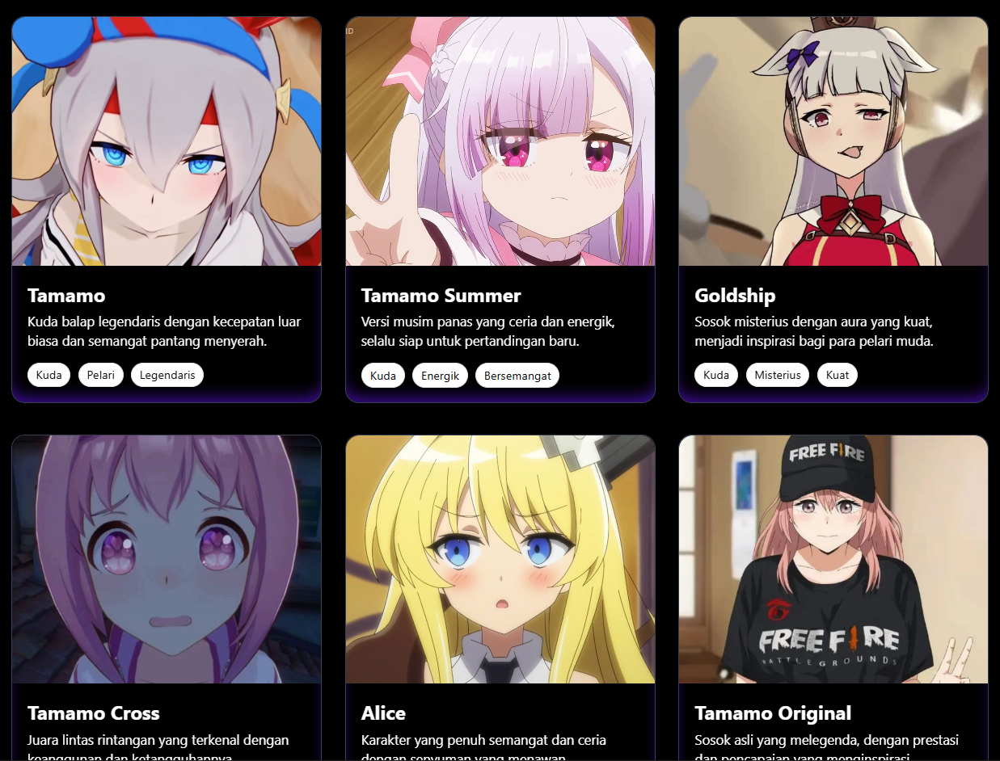
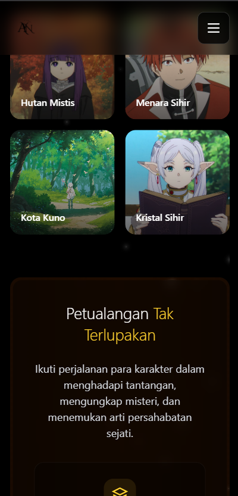

# 🌸 Anime Landing Page


Sebuah website landing page bertema **anime** yang dibuat menggunakan **Vite + Tailwind CSS + TypeScript**.  
Tampilan dibuat modern, interaktif, dan responsif dengan sentuhan elemen 3D ringan.

---

## 🖼️ Tampilan Website



---



---
`mobile mode`



---

## 🚀 Teknologi yang Digunakan
- ⚡ Vite
- 🎨 Tailwind CSS v4.1
- 💡 TypeScript
- 🌐 Responsive design

---

## 🧠 Cara Menjalankan
```bash
# Clone repository
git clone https://github.com/Resyourbae/Anime-landingPage.git

# Masuk ke folder project
cd Anime-landingPage

# Install dependencies
npm install

# Jalankan di localhost
npm run dev
